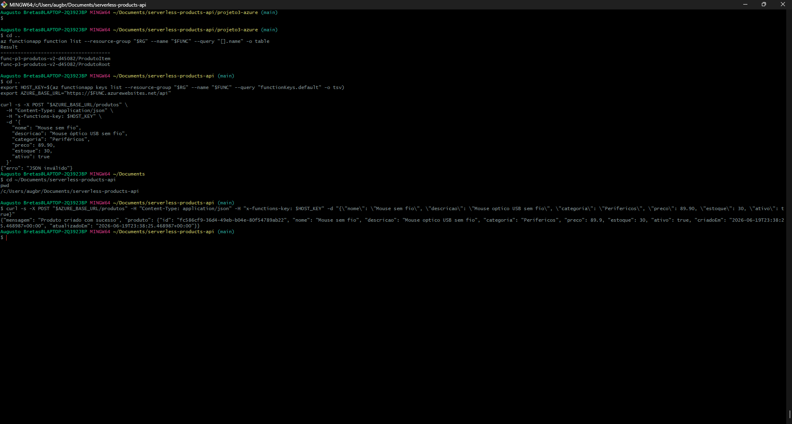
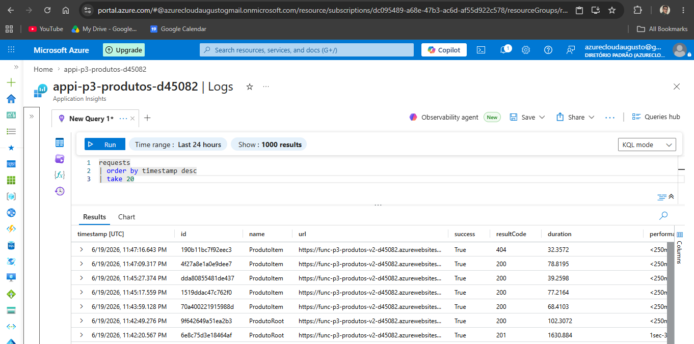
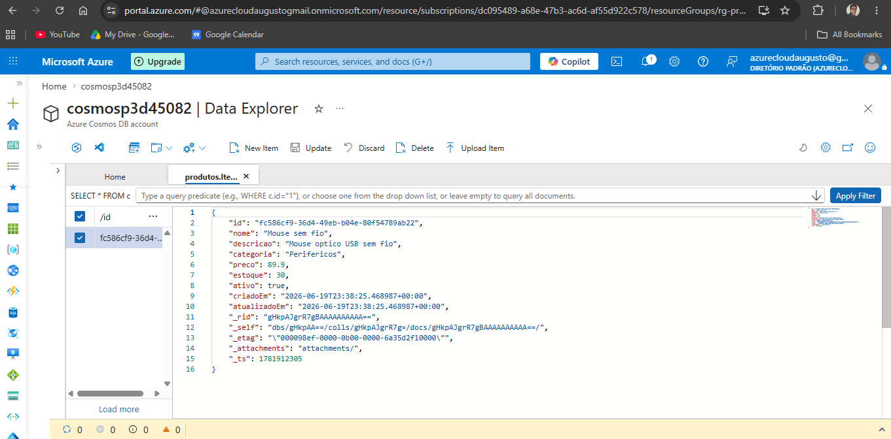
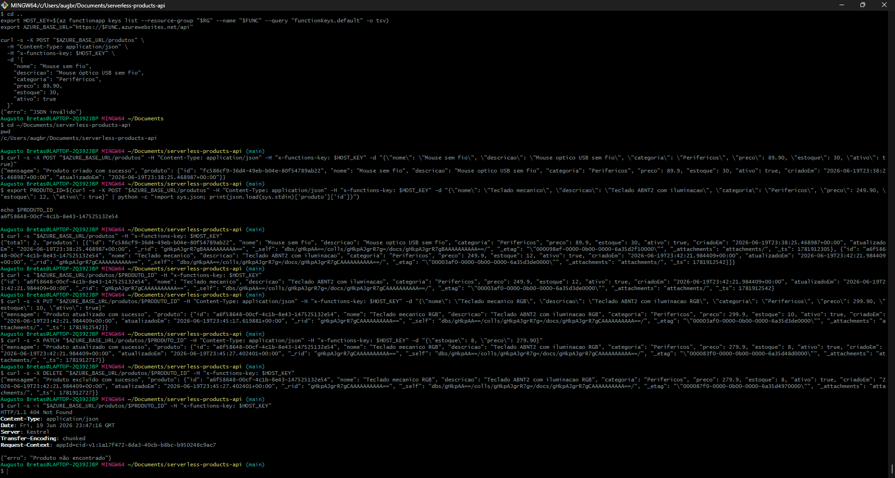
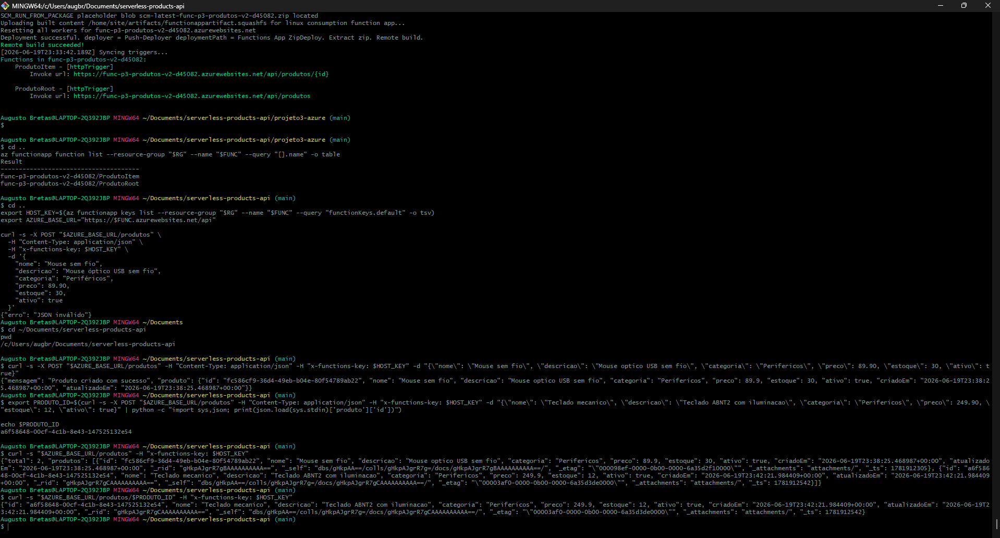
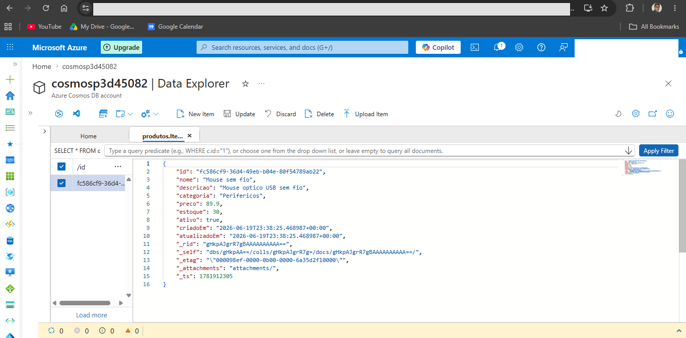
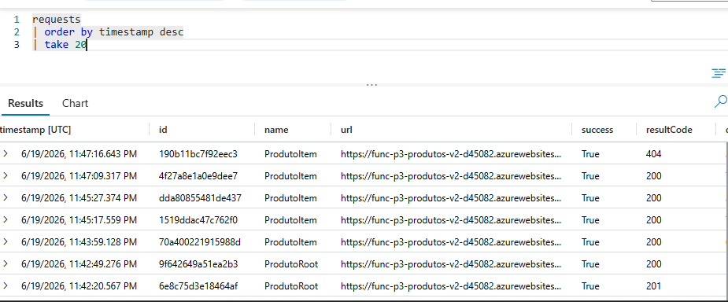
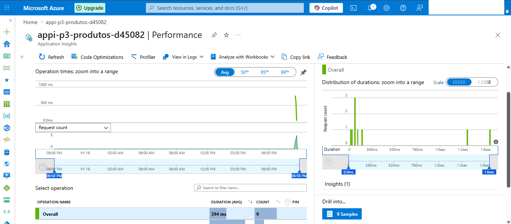

# Serverless Products API - Azure

Serverless REST API for product management, built with **Azure Functions** (V1 programming model) and **Azure Cosmos DB**.

## Stack

| Component | Service |
|---|---|
| Compute | Azure Functions (Python 3.11, Consumption Plan, V1 model) |
| NoSQL Database | Azure Cosmos DB (NoSQL API, Serverless mode) |
| Observability | Application Insights + Azure Monitor |

## Architecture
Postman / HTTP Client

│

▼

Azure Functions (HTTP Trigger)

├── ProdutoRoot   → GET, POST              /api/produtos

└── ProdutoItem   → GET, PUT, PATCH, DELETE /api/produtos/{id}

│

▼

Azure Cosmos DB (NoSQL)

│

└── Application Insights (logs, failures, performance)

└── Azure Monitor (alerts)

## Endpoints

| Method | Route | Description | Status |
|---|---|---|---|
| POST | /produtos | Create product | 201 |
| GET | /produtos | List all products | 200 |
| GET | /produtos/{id} | Get product by ID | 200 / 404 |
| PUT | /produtos/{id} | Full update | 200 / 404 |
| PATCH | /produtos/{id} | Partial update | 200 / 404 |
| DELETE | /produtos/{id} | Delete product | 200 / 404 |

## Project structure
serverless-products-api/

├── projeto3-azure/

│   ├── ProdutoRoot/        # GET, POST /produtos

│   ├── ProdutoItem/        # GET, PUT, PATCH, DELETE /produtos/{id}

│   ├── shared_code/        # Cosmos DB client and helpers

│   ├── host.json

│   └── requirements.txt

├── infra/

│   └── variaveis.sh        # Resource names (no secrets)

├── postman/

│   └── produtos-api-collection.json

├── evidencias/             # Test, database, logs, dashboard and alert screenshots

└── README.md

## Prerequisites

- Azure CLI (`az version`)
- Azure Functions Core Tools v4 (`func --version`)
- Python 3.11

## How to reproduce

### 1. Clone the repository

```bash
git clone https://github.com/SEU_USUARIO/serverless-products-api.git
cd serverless-products-api
```

### 2. Provision the infrastructure

```bash
export LOCATION=brazilsouth
export SUFIXO=$(openssl rand -hex 3)
export RG="rg-projeto3-produtos-$SUFIXO"
export STORAGE="stp3$SUFIXO"
export FUNC="func-p3-produtos-$SUFIXO"
export COSMOS="cosmosp3$SUFIXO"
export DB_NAME="dbprodutos"
export CONTAINER_NAME="produtos"
export APPINSIGHTS="appi-p3-produtos-$SUFIXO"

az group create --name "$RG" --location "$LOCATION"
az storage account create --name "$STORAGE" --resource-group "$RG" --location "$LOCATION" --sku Standard_LRS
az cosmosdb create --name "$COSMOS" --resource-group "$RG" --locations regionName="$LOCATION" failoverPriority=0 --capabilities EnableServerless
az cosmosdb sql database create --account-name "$COSMOS" --resource-group "$RG" --name "$DB_NAME"
az cosmosdb sql container create --account-name "$COSMOS" --resource-group "$RG" --database-name "$DB_NAME" --name "$CONTAINER_NAME" --partition-key-path //id
az monitor app-insights component create --app "$APPINSIGHTS" --location "$LOCATION" --resource-group "$RG" --application-type web
az functionapp create --resource-group "$RG" --consumption-plan-location "$LOCATION" --runtime python --runtime-version 3.11 --functions-version 4 --name "$FUNC" --storage-account "$STORAGE" --os-type Linux
```

### 3. Configure the Function App settings

```bash
export COSMOS_CONN=$(az cosmosdb keys list --name "$COSMOS" --resource-group "$RG" --type connection-strings --query "connectionStrings[0].connectionString" -o tsv)
export APPINSIGHTS_CONN=$(az monitor app-insights component show --app "$APPINSIGHTS" --resource-group "$RG" --query "connectionString" -o tsv)

az functionapp config appsettings set --resource-group "$RG" --name "$FUNC" --settings \
  COSMOS_CONNECTION_STRING="$COSMOS_CONN" \
  COSMOS_DATABASE="$DB_NAME" \
  COSMOS_CONTAINER="$CONTAINER_NAME" \
  APPLICATIONINSIGHTS_CONNECTION_STRING="$APPINSIGHTS_CONN" \
  SCM_DO_BUILD_DURING_DEPLOYMENT=true \
  ENABLE_ORYX_BUILD=true
```

### 4. Publish the code

```bash
cd projeto3-azure
func azure functionapp publish "$FUNC" --python
cd ..
```

> **Important:** use `func azure functionapp publish` (Azure Functions Core Tools), not `az functionapp deployment source config-zip`. The latter doesn't reliably sync triggers in some scenarios, causing the functions to never show up even after a "successful" deploy.

### 5. Test it

```bash
export HOST_KEY=$(az functionapp keys list --resource-group "$RG" --name "$FUNC" --query "functionKeys.default" -o tsv)
export AZURE_BASE_URL="https://$FUNC.azurewebsites.net/api"

curl -s -X POST "$AZURE_BASE_URL/produtos" \
  -H "Content-Type: application/json" \
  -H "x-functions-key: $HOST_KEY" \
  -d '{"nome":"Mouse","descricao":"Wireless USB mouse","categoria":"Peripherals","preco":89.90,"estoque":10,"ativo":true}'
```

## Postman Collection

Import `postman/produtos-api-collection.json` and configure:
- `baseUrl`: your Function App URL
- `functionKey`: key obtained via `az functionapp keys list`

## Monitoring

- **Logs and executions:** Application Insights → Logs (KQL) or Performance
- **Configured alerts:**
  - `alerta-api-produtos-falhas` — triggers when request failures are detected
  - `alerta-api-produtos-latencia` — triggers when average latency exceeds 2 seconds

## Cleanup

```bash
source infra/variaveis.sh
az group delete --name "$RG" --yes --no-wait
```

## Evidence

### API Tests

**Create product (POST) — returns 201 with generated ID:**


**List all and get by ID (GET):**


**Full and partial update (PUT / PATCH):**


**Delete and 404 validation (DELETE then GET):**


**Function deployment with synced triggers:**


### Database

**Cosmos DB Data Explorer showing a persisted product:**


### Monitoring

**Application Insights — request logs (KQL query results):**


**Application Insights — performance metrics (duration, request count):**


### Alerts

**Two alert rules configured in Azure Monitor (failures + latency):**


## Academic project

Built as a project for a Cloud Computing course, following the detailed lab guide provided in class. Full Azure implementation, with working CRUD, Function Key-based security, observability via Application Insights, and alerts configured in Azure Monitor.
